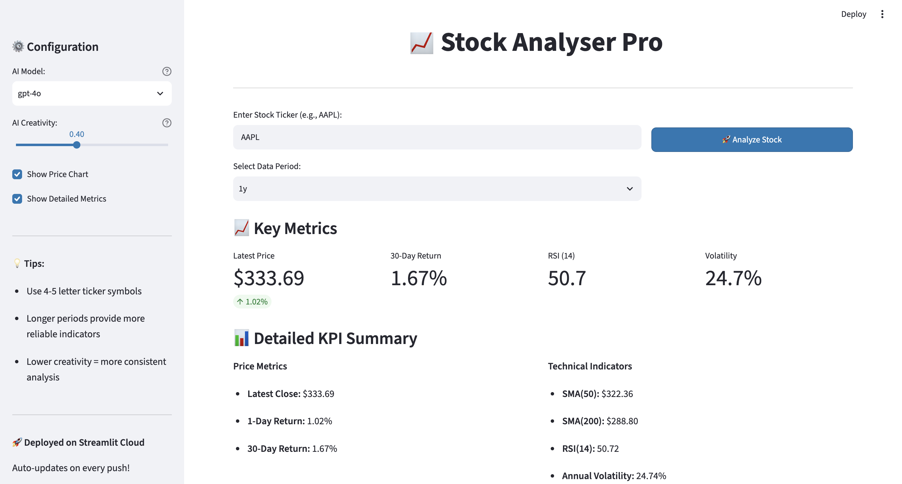
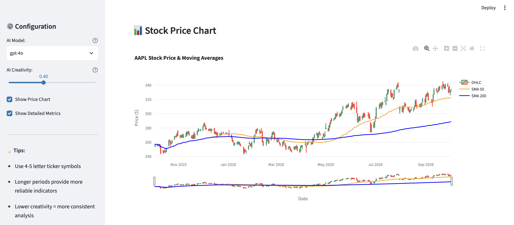
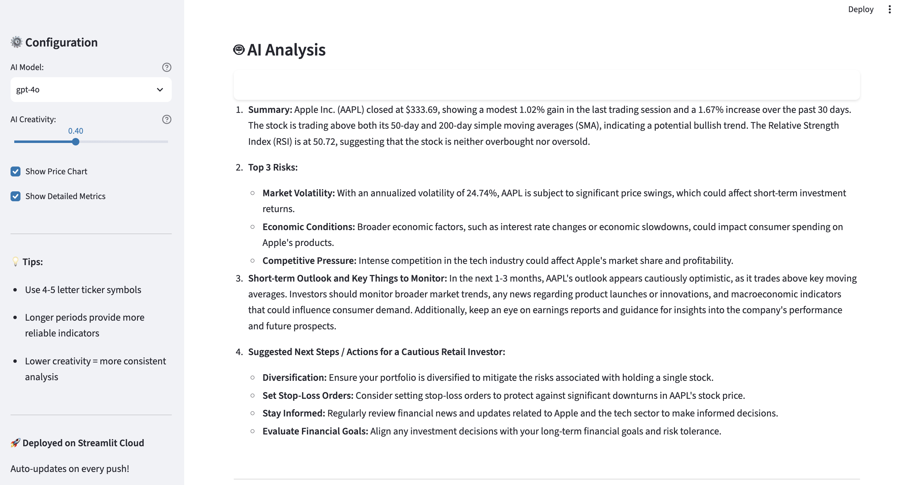

# Stock Analyser

A Python dashboard that combines historical stock data, technical indicators, and LLM-generated commentary in one exploratory interface.

**Stack:** Python · Streamlit · yfinance · pandas · NumPy · Plotly · LangChain · OpenAI API

## Preview

### Key Metrics


### Price Chart


### AI Commentary


[Try the live dashboard](https://aistockanalyser.streamlit.app/)

## Features

- Retrieve historical prices for a selected ticker and time period.
- Explore price charts and 50- and 200-period moving averages.
- Calculate daily returns, RSI, and annualized volatility.
- Generate commentary from a formatted summary of the calculated metrics.

## Run locally

```bash
git clone https://github.com/monisha-krishnamurthy/StockAnalyser.git
cd StockAnalyser
python3 -m venv .venv
source .venv/bin/activate
python -m pip install -r requirements.txt
```

Configure `OPENAI_API_KEY` in your local environment or `.env` file, then launch:

```bash
streamlit run streamlit_stock_analyser.py
```

Select a ticker, period, and available model settings in the interface. Market data requires an internet connection; OpenAI calls require API access and may incur charges. Never commit a real key to the tracked placeholder `.env` file.

## How it works

Historical prices → calculated indicators → formatted metric summary → LLM commentary.

- `data_downloader.py`: price retrieval.
- `kpis.py`: indicator calculations and prompt formatting.
- `stock_analyser.py`: LangChain/OpenAI analysis functions and a command-line example.
- `streamlit_stock_analyser.py`: dashboard interface.
- `test_deployment.py`: deployment diagnostic script.

## Limitations

This is an educational prototype. Generated commentary is not a validated prediction or investment recommendation. Data availability and model access depend on external services.

Dependencies use broad version ranges, and the analysis module uses older LangChain interfaces; compatibility needs checking in a fresh environment. The metric labeled `30d_return_pct` uses a trading-row offset rather than an exact calendar-month interval. Export and portfolio comparison are not implemented features.
